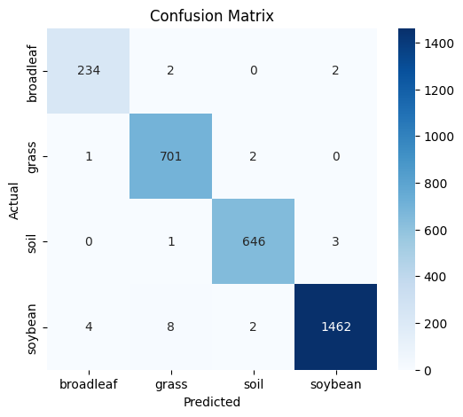
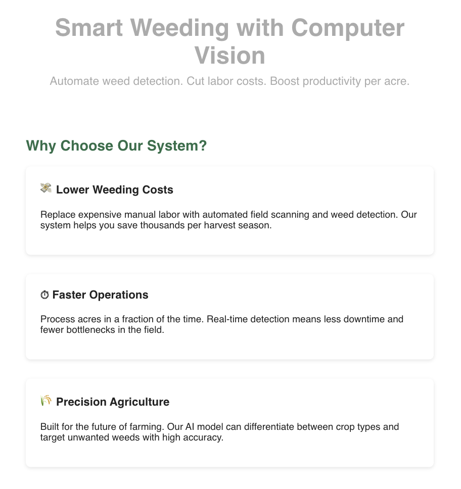

# ADS599-Capstone

**Executive Summary:** [Deep Learning-Based Plant Identification for Automated Agricultural Weed Control](whitepaper.md)

The final deliverable includes both **trained models** and a **web application** that showcases results and features a **Cost Savings Calculator**.

---

## Navigation
- **`/notebooks/`** – Jupyter notebooks for data exploration, preprocessing, training, and evaluation.
- **`/outputs/`** – Model performance visualizations, including confusion matrices and classification reports.
- **`/html/`** – Web application files (auto-updates from GitHub).
- **`/imports.py`** – Centralized Python imports for all notebooks.
- **`README.md`** – You are here.

---

## Dataset
- **Source:** [Weed Detection in Soybean Crops (Kaggle)](https://www.kaggle.com/datasets/fpeccia/weed-detection-in-soybean-crops)

## Dataset Location
The dataset **is not** stored in this GitHub repository due to its large size.

## Local Storage
When first downloaded via the KaggleHub API, the dataset is stored in your local cache directory:
Example Path: C:\Users<YourUser>.cache\kagglehub\datasets\fpeccia\weed-detection-in-soybean-crops\versions\1\dataset

The dataset is comprised of 4 folders representing the 4 classes below

- **Total Images:** 15,336 TIFF images
- **Classes:**  
  1. Broadleaf weeds  
  2. Grass weeds  
  3. Soil  
  4. Soybean crops

All images were standardized to **224×224 px** with zero-padding to preserve aspect ratio.

---

## Modeling Approach
We implemented a standardized training and validation pipeline:
1. **Data Split:** Stratified 80:20 train-validation split to preserve class balance.
2. **Preprocessing:** Resizing, zero-padding, and rescaling.
3. **Class Imbalance Handling:** Oversampling, aggressive augmentation, and class weighting.
4. **Training Controls:** Early stopping to prevent overfitting.
5. **Evaluation:** Confusion matrices and classification reports.

### Model Highlights
- **EfficientNetB0** and **MobileNetV2** achieved **>99% accuracy** with minimal misclassifications.
- **Baseline CNN** recall for *broadleaf* improved from 0.71 → 0.86 with augmentation and weighting.
- **ResNet-50** performed well but showed moderate confusion between *broadleaf* and *grass*.

---

## Key Results
### Example Confusion Matrix (MobileNetV2)


**Performance Snapshot:**
| Model         | Accuracy | Broadleaf Recall | Strengths                                      |
|---------------|----------|------------------|------------------------------------------------|
| Baseline CNN  | 94%      | 0.88              | Improved with targeted augmentation            |
| EfficientNetB0| 99.7%    | 0.99              | Balanced high accuracy with efficiency         |
| MobileNetV2   | 99%      | 0.98              | Lightweight and ideal for edge deployment      |
| ResNet-50     | 84%      | 0.80              | Strong on distinct classes, struggled on similar ones |

---

## Web Application
The web app demonstrates:
- **Model Performance Visuals** – Confusion matrices and accuracy curves.
- **Automated Updates** – Syncs with GitHub for real-time model result deployment.
- **Savings Calculator:** Cost Savings Calculator for estimating labor and expense reductions.

**Screenshot:**



## Installation & Usage
1. **Clone the repository:**
   ```bash
   git clone https://github.com/edgar-rosales95/ADS599-Capstone.git

Install Python **3.9+** if you don’t already have it. Then install all dependencies listed in `requirements.txt`:

```bash
pip install -r requirements.txt
```

To explore the dataset, train models, or view analysis results, launch Jupyter:

```bash
jupyter notebook
```

Open any of the `.ipynb` files in the `/notebooks/` directory.

The web application uses **`index.php`** and requires PHP to be installed locally.

**Install PHP (if not already installed):**

* **Windows:** Download from [https://windows.php.net/download/](https://windows.php.net/download/)
* **macOS:**

  ```bash
  brew install php
  ```
* **Linux (Debian/Ubuntu):**

  ```bash
  sudo apt install php
  ```

Run the PHP server:

```bash
cd html
php -S localhost:8000
```

Visit: [http://localhost:8000/index.php](http://localhost:8000/index.php)

**Notes:**

* The notebooks will automatically download the dataset via the KaggleHub API. You may need a Kaggle account and API key configured locally.
* All model performance plots (confusion matrices, classification summaries) are saved to the `/outputs/` directory and automatically update the web app when pushed to GitHub.

## Project Team
|--------------|
Edgar Rosales 
Marinela Inguito
Bobby Marriott
